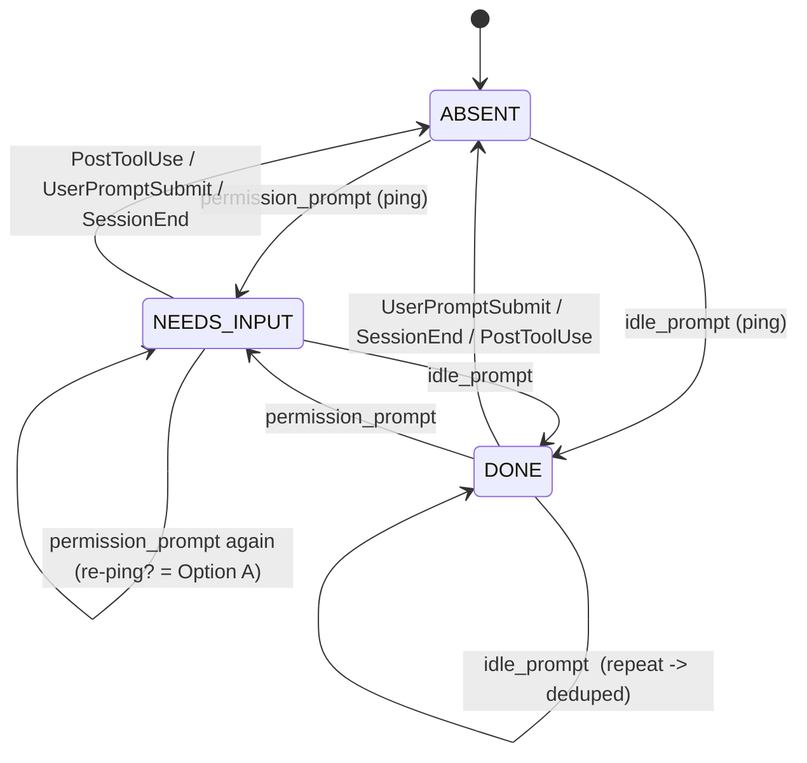

# Notification state machine & the "clear on answer" problem

Design notes for how a session's inbox state is set/cleared, and the open edge
case that gates the `PostToolUse`-clear fix. (2026-07-07)

## States (one row per session, keyed by `session_id`)

- **ABSENT** — not in the inbox (working, or never flagged).
- **NEEDS_INPUT** — Claude is blocked, waiting on you (red).
- **DONE** — Claude finished, waiting for your next prompt (green).

## Events → transitions

| Current | Event (hook) | New state | Notify? |
|---|---|---|---|
| any | `Notification` + `permission_prompt` | NEEDS_INPUT | ping (once; re-ping if dedup dropped) |
| any | `Notification` + `idle_prompt` | DONE | ping on transition |
| any | `UserPromptSubmit` (you typed) | ABSENT | — |
| any | `SessionEnd` | ABSENT | — |
| any | `PostToolUse` *(proposed clear)* | ABSENT | — |
| — | `Stop` | *(OBSERVE_ONLY — ignored)* | — |

## Two problems this addresses

1. **Re-notify** — a still-`NEEDS_INPUT` session doesn't re-ping on the next
   prompt (transition-dedup). Fix candidate = **Option A**: drop the dedup and
   ping every `permission_prompt` — *valid only if Claude fires it once per
   request (no re-emit)*. No doc evidence of re-emit; the old dedup was for the
   now-removed `Stop` hook. To confirm: leave a permission prompt unanswered and
   watch if the notification event logs once or repeatedly.

2. **Clear on answer** — answering *without typing* (clicking Allow, picking an
   option) does **not** fire `UserPromptSubmit`, so the row never clears and lies
   in the inbox. **Proven** (2026-07-07): answering an `AskUserQuestion` logged no
   clear event; the row stayed `NEEDS_INPUT`. The one universal "you answered"
   signal is **`PostToolUse`** — it fires after a granted permission's tool runs
   *and* after an `AskUserQuestion` tool completes. Fallback already present:
   `idle_prompt → DONE` moves it out of `NEEDS_INPUT` at turn end (just not
   promptly).

## Edge cases for `PostToolUse`-clear

1. Blocked, not yet answered → no tool runs → no `PostToolUse` → stays
   NEEDS_INPUT. ✅
2. You answer → tool runs / question completes → `PostToolUse` → ABSENT. ✅
3. Clearing is `WHERE session_id = ?`, so a tool use in session X can NOT clear
   session Y's notification. ✅ (by construction)
4. Two prompts in one turn → grant #1 → clear → ask #2 → fresh NEEDS_INPUT. ✅

### Edge case #5 — RESOLVED (2026-07-07, measured)

**Does a background subagent's `PostToolUse` carry the parent `session_id`?**
**Yes — and worse: it's indistinguishable from the main agent's.** A subagent's
three test tool-calls logged with `session_id` = the parent's *and*
`transcript_path` = the parent's transcript. No payload field separates them
(no `agent_type`; `session_id`/`transcript_path`/`prompt_id` all match the parent).

So `PostToolUse → clear` **can't be perfectly guarded**: while the main agent is
blocked on a permission (NEEDS_INPUT), a concurrent subagent finishing a tool
*will* clear the row, and we can't tell it apart from the user answering.

**Decision: accept it as a rare, low-harm residual.** The collision needs
`ask-mode ∧ a background subagent running ∧ a permission prompt in that window`
— uncommon, impossible in auto-approve. When it fires, harm is low: the real
permission dialog stays in the terminal (the inbox is only a reminder), and the
notify-every rule re-pings on the next prompt.

## Shipped design (implemented 2026-07-07)

- **Notify on every `permission_prompt`** — `notification` → NEEDS_INPUT,
  unconditional notify (no transition-dedup). Focus-suppression still applies.
- **`idle_prompt` → DONE**, transition-only notify.
- **`posttooluse` → `DELETE … WHERE session_id=? AND state='needs_input'`** — the
  `state='needs_input'` guard stops a tool call from wiping a `done` reminder (it
  does NOT stop the subagent residual above — that's accepted).
- Fallback still present: `idle_prompt → DONE` moves a row out of NEEDS_INPUT at
  turn end even if nothing else cleared it.

## Status
Implemented in `record_event.py` + `install.sh`; `PostToolUse` hooked in live
settings. Cost: `PostToolUse` fires per tool call (~tens of ms each, blocking).
